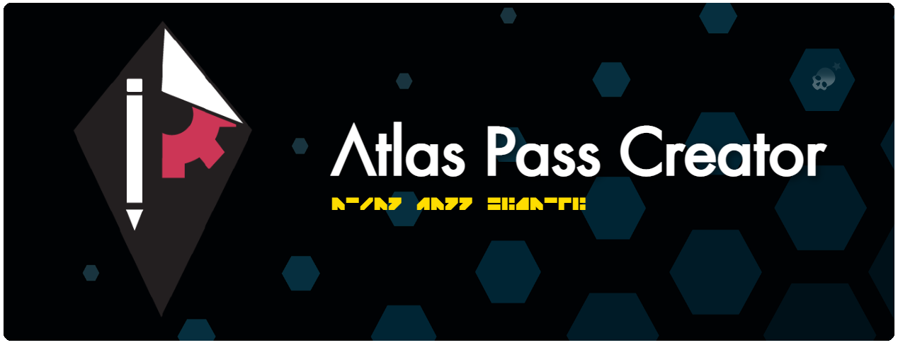

  
  

  ### Create your own Atlas Pass quickly and easily using this NMSCD tool! Easily upload custom backgrounds and images, style text, snap elements to the grid, manage layers and so much more!
  
   
  
  
   
  [][nmscd] 
  

 

## 🏃‍♂️ Running the project

 
  
### Requirements
- [NodeJS](https://nodejs.org/en/download/)

### Steps:
1. Clone this repository
2. In the directory where the `package.json` file is, run `npm i`
3. Run the webApp `npm run dev`
4. View it on [localhost:3000](http://localhost:3000)

 

<!-- Links used in the page -->

[kurtGithub]: https://github.com/Khaoz-Topsy?ref=AssistantNMSGithub
[assistantAppsTools]: https://tools.assistantapps.com?ref=AssistantNMSGithub
[assistantnmsWebsite]: https://nmsassistant.com?ref=AssistantNMSGithub
[assistantnmsWebapp]: https://app.nmsassistant.com?ref=AssistantNMSGithub
[assistantnmsTwitter]: https://twitter.com/AssistantNMS?ref=AssistantNMSGithub
[assistantnmsFacebook]: https://facebook.com/AssistantNMS?ref=AssistantNMSGithub
[assistantnmsSteamComm]: https://steamcommunity.com/groups/AssistantNMS?ref=AssistantNMSGithub
[googlePlayStore]: https://play.google.com/store/apps/details?id=com.kurtlourens.no_mans_sky_recipes&ref=AssistantNMSGithub
[appleAppStore]: https://apps.apple.com/us/app/assistant-for-no-mans-sky/id1480287625?ref=AssistantNMSGithub
[windowsStore]: https://apps.microsoft.com/store/detail/assistant-for-no-mans-sky/9NQLF7XD0LF3?ref=AssistantNMSGithub
[discord]: https://assistantapps.com/discord?ref=AssistantNMSGithub
[nmscd]: https://github.com/NMSCD?ref=AssistantNMSGithub

<!-- Other -->
[mbincompiler]: https://github.com/monkeyman192/MBINCompiler
[flutter]: https://docs.flutter.dev/get-started/install
[androidStudio]: https://developer.android.com/studio
[codeMagic]: https://codemagic.io
