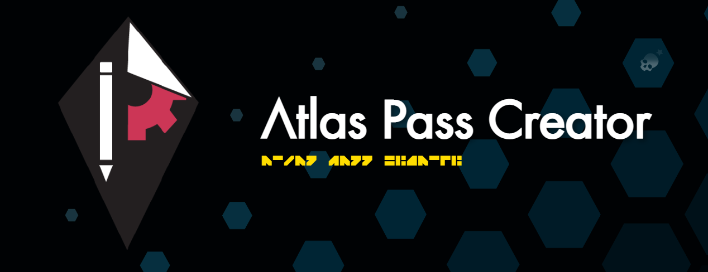

  
  # Atlas Pass Creator
  
  
   
  
  
   
  [][nmscd] 
  
    

Create your own Atlas Pass quickly and easily using this NMSCD tool! Easily upload custom backgrounds and images, style text, snap elements to the grid, manage layers and so much more!

<!-- Links used in the page -->

[kurtGithub]: https://github.com/Khaoz-Topsy?ref=AssistantNMSGithub
[assistantAppsTools]: https://tools.assistantapps.com?ref=AssistantNMSGithub
[assistantnmsWebsite]: https://nmsassistant.com?ref=AssistantNMSGithub
[assistantnmsWebapp]: https://app.nmsassistant.com?ref=AssistantNMSGithub
[assistantnmsTwitter]: https://twitter.com/AssistantNMS?ref=AssistantNMSGithub
[assistantnmsFacebook]: https://facebook.com/AssistantNMS?ref=AssistantNMSGithub
[assistantnmsSteamComm]: https://steamcommunity.com/groups/AssistantNMS?ref=AssistantNMSGithub
[googlePlayStore]: https://play.google.com/store/apps/details?id=com.kurtlourens.no_mans_sky_recipes&ref=AssistantNMSGithub
[appleAppStore]: https://apps.apple.com/us/app/assistant-for-no-mans-sky/id1480287625?ref=AssistantNMSGithub
[windowsStore]: https://apps.microsoft.com/store/detail/assistant-for-no-mans-sky/9NQLF7XD0LF3?ref=AssistantNMSGithub
[discord]: https://assistantapps.com/discord?ref=AssistantNMSGithub
[nmscd]: https://github.com/NMSCD?ref=AssistantNMSGithub

<!-- Other -->
[mbincompiler]: https://github.com/monkeyman192/MBINCompiler
[flutter]: https://docs.flutter.dev/get-started/install
[androidStudio]: https://developer.android.com/studio
[codeMagic]: https://codemagic.io
